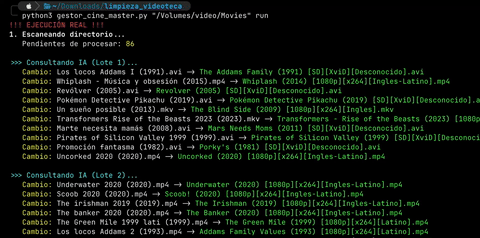

# 🎬 CineManager AI (Gestor de Videoteca)

<p align="center">
  
</p>

> **Gestor de Videoteca Inteligente:** Automatiza, renombra y audita tu colección de películas usando Google Gemini y FFmpeg.

## 🚀 Características

- **Sanitización por IA:** Utiliza Google Gemini 2.5 para inferir el título oficial y año de estreno, corrigiendo nombres "sucios" (ej: `Matrix.Reloaded.1080p.avi` -> `The Matrix Reloaded (2003)`).
- **Análisis Técnico:** Extrae resolución (4K, 1080p, SD), códec (x265, x264) e idiomas de audio usando `ffprobe`.
- **Idempotencia (Manifiesto):** Mantiene un registro `.cine_manifest.json` para no volver a procesar archivos ya verificados, ahorrando cuota de API y tiempo.
- **Gestión de Duplicados:** Evita colisiones de nombres añadiendo contadores y genera un reporte final de auditoría para identificar versiones de baja calidad.
- **Anti-Bloqueo:** Sistema de "Retry Logic" con espera exponencial para manejar los límites de tasa (Rate Limits) de la API de Google.

## 📋 Requisitos Previos

1. **Python 3.10+**
2. **FFmpeg instalado** (necesario para `ffprobe`).

- macOS: `brew install ffmpeg`
- Linux: `apt install ffmpeg`

3. **API Key de Google Gemini** (Google AI Studio).

## 🛠 Instalación

1.  **Crear entorno virtual:**

    ```bash
    python3 -m venv cine_env
    source cine_env/bin/activate
    ```

2.  **Instalar dependencias:**

    ```bash
    pip install google-genai python-dotenv
    ```

3.  **Configurar Variables de Entorno (Seguridad):**
    Crea un archivo llamado `.env` en la misma carpeta del script y añade tu clave. Así no la expones en el código.
    ```bash
    echo "GEMINI_API_KEY=TuClaveSecretaDeGoogleAqui" > .env
    ```

## ⚙️ Configuración

Puedes configurar el comportamiento editando las variables al inicio del script o usando el archivo `.env`.

| Variable             | Descripción                  | Valor por Defecto                        |
| :------------------- | :--------------------------- | :--------------------------------------- |
| `IDIOMA_TITULO`      | Preferencia de nombres.      | `"original"` (Inglés) o `"es"` (Español) |
| `MODELO_IA`          | Versión del modelo Gemini.   | `"gemini-2.5-flash"`                     |
| `ARCHIVO_MANIFIESTO` | Nombre del log de auditoría. | `".cine_manifest.json"`                  |

> **Nota:** El script buscará automáticamente la `GEMINI_API_KEY` en el archivo `.env`. Si no la encuentra, intentará usar la variable dentro del código.

## ▶️ Uso

### 1. Modo Simulación (Dry Run)

Muestra qué cambios se harían sin tocar los archivos. Ideal para verificar antes de actuar.

```bash
python3 gestor_cine_master.py "/Ruta/A/Tus/Peliculas"

```

### 2. Modo Ejecución (Live)

Aplica los cambios de nombre y actualiza el manifiesto.

```bash
python3 gestor_cine_master.py "/Ruta/A/Tus/Peliculas" run

```

### Ejemplo de Salida

```text
1. Escaneando directorio...
   Pendientes de procesar: 12

>>> Consultando IA (Lote 1)...
   Cambio: Matrix.avi -> The Matrix (1999) [SD][XviD][Ingles].avi
   Cambio: toy_story_1.mp4 -> Toy Story (1995) [720p][x264][Latino].mp4

✅ Manifiesto actualizado.
```

## 🧠 Lógica de Decisión (Flujo)

1. **Escaneo:** Recorre la carpeta recursivamente.
2. **Filtro Manifiesto:**

- ¿El archivo está en `.cine_manifest.json`? -> **Ignorar**.
- ¿No está, pero ya cumple el formato `Nombre (Año) [Datos]`? -> **Adoptar** (Agregar al json y saltar).

3. **Procesamiento IA:**

- Agrupa archivos restantes en lotes de 10.
- Envía nombres a Gemini para obtener `Título Oficial` y `Año`.
- Extrae metadatos técnicos localmente con `ffprobe`.

4. **Renombrado:** Aplica el cambio `Original.ext` -> `Título (Año) [Res][Codec][Audio].ext`.
5. **Auditoría:** Al final, escanea todo en busca de archivos con el mismo `Título (Año)` y muestra una tabla comparativa para borrado manual.

## ❓ Solución de Problemas

**Error: `429 RESOURCE_EXHAUSTED`**

- **Causa:** Has superado el límite de peticiones gratuitas de Google (15 RPM).
- **Solución:** El script entrará automáticamente en modo "Enfriamiento" y esperará 65 segundos antes de reintentar. No cierres la terminal, solo espera.

**Error: `[ERROR-METADATA]` en el nombre del archivo**

- **Causa:** `ffprobe` no pudo leer el archivo de video.
- **Solución:** Verifica que el archivo no esté corrupto y que tengas FFmpeg instalado (`brew install ffmpeg`).

**La IA pone el nombre en Inglés pero yo quería Español**

- **Solución:** Cambia la variable `IDIOMA_TITULO = "es"` en el script.

## 🧹 Limpieza y Desinstalación

Cuando termines de usar la herramienta, es recomendable desactivar el entorno virtual.

**1. Salir del entorno (Desactivar):**
Simplemente ejecuta:

```bash
deactivate

```

_Verás que el prefijo `(cine_env)` desaparece de tu terminal._

**2. Eliminar el entorno (Opcional):**
Si ya no necesitas la herramienta y quieres liberar espacio (borrar las librerías descargadas):

```bash
# Asegúrate de estar fuera del entorno primero (deactivate)
rm -rf cine_env

```

_Esto no borrará tus scripts ni tu videoteca, solo las librerías de Python._
